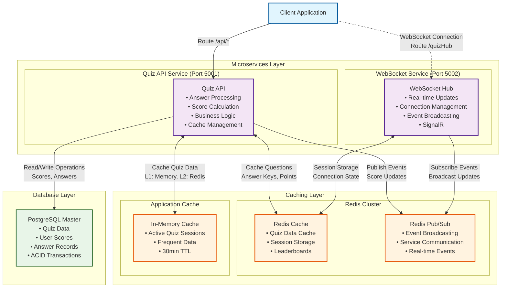
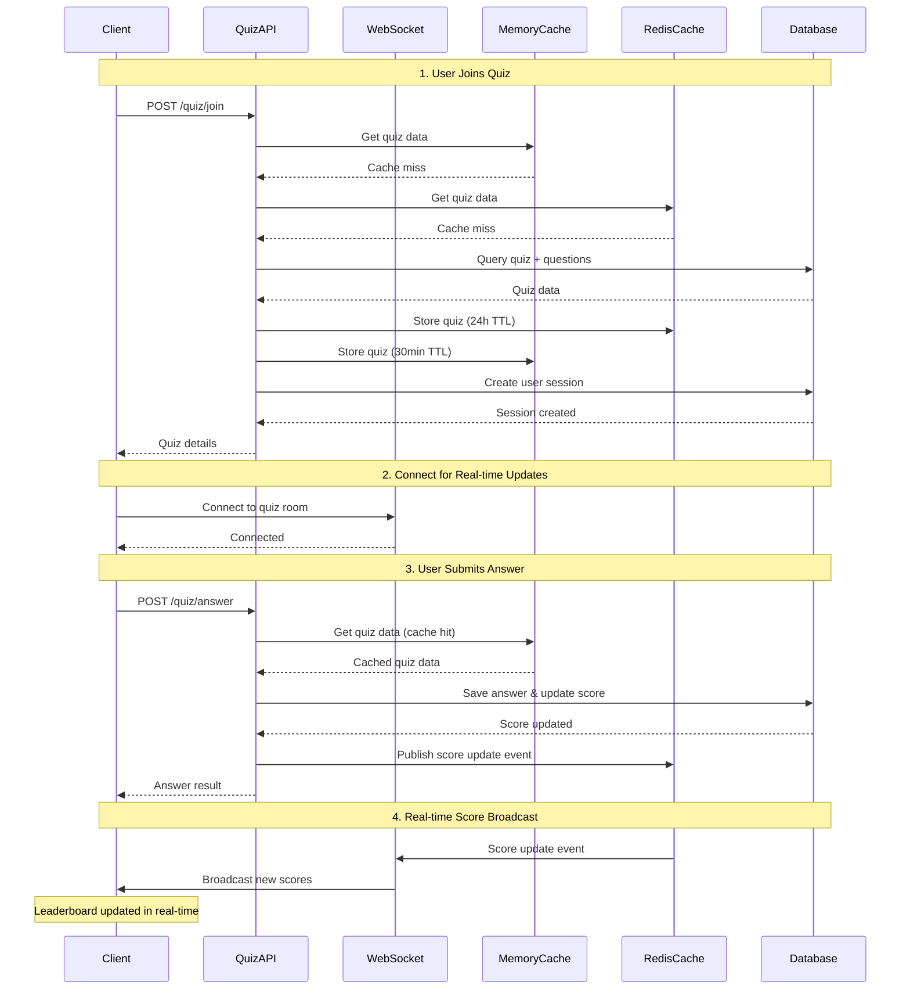

## System overview

### Data flow
This diagram describes the flow from when a user joins a quiz to when the leaderboard is updated

### AI Collaboration in Design
#### Discuss current Elsa's system design, tech stacks, infrastructure ...
This prompt was, mostly, for me to have any overview of how Elsa is built and the technical stacks that are being used. Elsa is using AWS, which doesn't really friendly for a quick coding challenge, so I decided to use another stack, specifically for the demonstration purpose.

#### Elsa number of users, concurrent users
I want to know the number of users/concurrent users the Quiz application need to serve. Elsa have over 15 millions total users, with around 4 millions recording daily. This is the conservative estimate of number of concurrent users:
- **Normal peak**: 25k-50k concurrent users
- **Global peak hours**: 75k-100k+ concurrent users
- **Event-driven spikes**: 150k+ concurrent users

Which is high. It's the main reason I chose the current architecture design.

### Key decisions
- **Service Separation**: WebSocket service isolated to handle connection overhead without affecting API performance. Allow them to be scaled independently.
- **Multi-Level Caching**: L1 (in-memory) + L2 (Redis) reduces database load by ~90%. Quiz data should rarely be changed but will be used very frequently. It's the perfect candidate for caching.
- **Redis Pub/Sub**: Enables real-time score updates across all connected clients. Simple to use. Consider using Kafka for higher throughput, better durability and guarantee delivery.
- **Partially adopt DDD**: For better code maintainability.
    - Enhanced encapsulation and behavior-rich domain models.
    - Clear separation of concerns between application logic, domain logic and infrastructure.
    - (Almost) Always-valid models